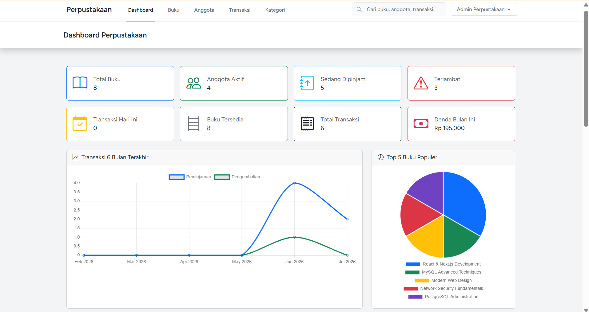
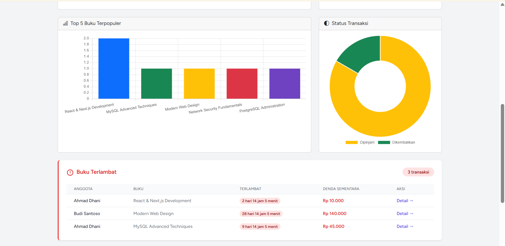
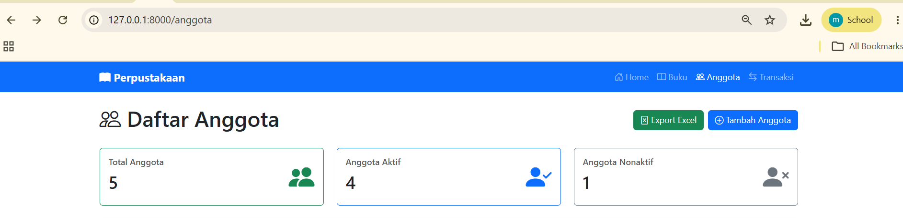
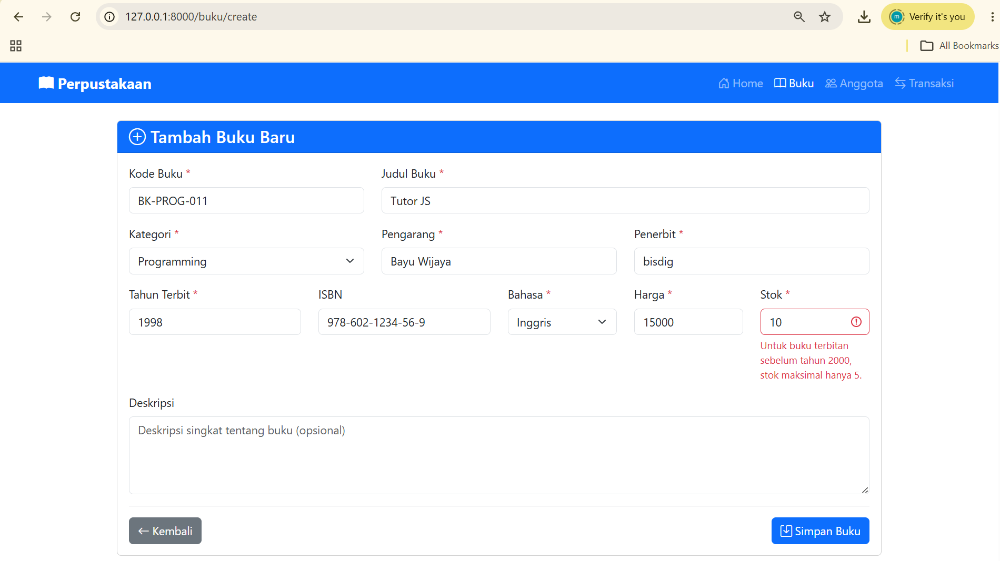
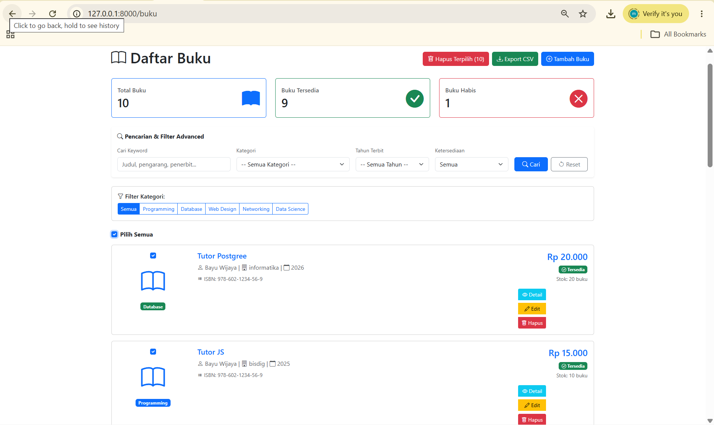
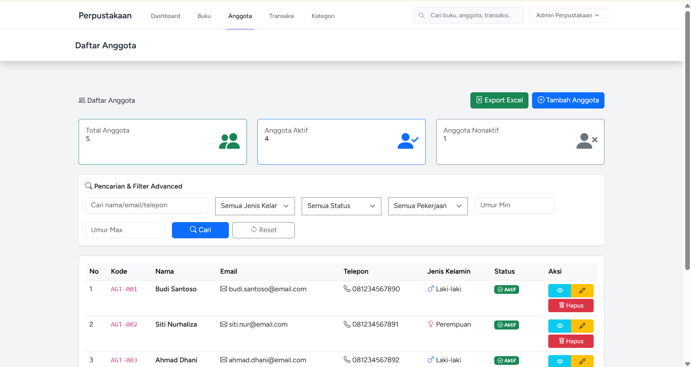
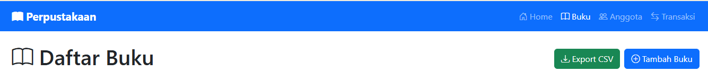

# 📚 Sistem Manajemen Perpustakaan

Aplikasi web manajemen perpustakaan berbasis **Laravel 12** yang dirancang untuk mengelola seluruh operasional perpustakaan secara digital. Sistem ini mencakup pengelolaan koleksi buku, keanggotaan, transaksi peminjaman & pengembalian, hingga pelaporan yang lengkap dan terstruktur.

## 👤 Author
- **Nama:** Muhammad Hamdi Yahya
- **NIM:** 60324035
- **Kelas:** B
- **Mata Kuliah:** Pemrograman Web 2

---

## 🚀 Fitur Lengkap

### Authentication & Keamanan
- [x] Login & Register dengan Laravel Breeze
- [x] Logout
- [x] Password hashing (bcrypt)
- [x] Middleware protection pada semua route

### CRUD Buku
- [x] Tambah, lihat, edit, dan hapus data buku
- [x] Validasi input dengan Form Request
- [x] Pencarian keyword (judul, pengarang, penerbit)
- [x] Filter advanced (kategori, tahun, ketersediaan, range harga)
- [x] Export data ke CSV
- [x] Bulk delete dengan SweetAlert konfirmasi

### CRUD Anggota
- [x] Tambah, lihat, edit, dan hapus data anggota
- [x] Auto-generate kode anggota (AGT-YYYY-XXX)
- [x] Validasi email & telepon
- [x] Filter berdasarkan jenis kelamin, status, pekerjaan, range umur
- [x] Export data ke Excel (.xlsx)
- [x] Riwayat peminjaman per anggota

### CRUD Kategori
- [x] Kelola kategori buku (tambah, edit, hapus)
- [x] Relasi kategori ke buku

### Transaksi Peminjaman
- [x] Form peminjaman buku
- [x] Auto-generate kode transaksi (TRX-XXX)
- [x] Tanggal kembali otomatis (+7 hari)
- [x] Auto update stok buku (-1 saat pinjam)
- [x] Validasi stok tersedia & anggota aktif
- [x] Database transaction untuk konsistensi data

### Pengembalian Buku
- [x] Update status menjadi "Dikembalikan"
- [x] Perhitungan denda otomatis (Rp 5.000/hari keterlambatan)
- [x] Auto update stok buku (+1 saat kembali)
- [x] Konfirmasi pengembalian dengan SweetAlert
- [x] Pencegahan double return

### Dashboard
- [x] 8 kartu statistik (Total Buku, Anggota Aktif, Sedang Dipinjam, Terlambat, Transaksi Hari Ini, Buku Tersedia, Total Transaksi, Denda Bulan Ini)
- [x] Line Chart — Transaksi 6 Bulan Terakhir
- [x] Pie Chart — Top 5 Buku Populer
- [x] Bar Chart — Buku Terpopuler
- [x] Donut Chart — Status Transaksi
- [x] Tabel buku terlambat dengan estimasi denda
- [x] Tabel transaksi terbaru
- [x] Quick Action (Tambah Buku, Tambah Anggota, Pinjam Buku, Lihat Transaksi)

### Global Search
- [x] Pencarian di 3 modul (Buku, Anggota, Transaksi)
- [x] Hasil dalam tabs dengan badge counter
- [x] Keyword highlighting pada hasil pencarian
- [x] Statistik ringkasan hasil pencarian
- [x] Search box di navbar (desktop & mobile)

### Laporan Transaksi
- [x] Filter berdasarkan range tanggal, status, dan anggota
- [x] Ringkasan statistik (Total, Dipinjam, Dikembalikan, Total Denda)
- [x] Export laporan ke PDF (DomPDF)
- [x] Print-friendly layout

---

## 📸 Screenshots

> Semua screenshot disimpan di folder `image/`

### 1. Dashboard Perpustakaan
Halaman utama yang menampilkan 8 kartu statistik, 4 chart interaktif (Line, Pie, Bar, Donut), tabel buku terlambat, transaksi terbaru, serta tombol aksi cepat.




---

### 2. Halaman Daftar Buku
Menampilkan seluruh koleksi buku dengan card layout, dilengkapi statistik (Total, Tersedia, Habis), filter advanced (keyword, kategori, tahun, ketersediaan, range harga), filter kategori cepat, serta tombol aksi (Detail, Edit, Hapus) pada setiap buku.



---

### 3. Halaman Daftar Transaksi
Menampilkan seluruh riwayat transaksi peminjaman dalam format tabel dengan informasi kode transaksi, anggota, buku, tanggal pinjam, tanggal kembali, dan status (termasuk badge Terlambat untuk peminjaman yang melewati batas waktu).



---

### 4. Detail Transaksi & Pengembalian Buku
Halaman detail yang menampilkan informasi lengkap transaksi, termasuk peringatan keterlambatan (jika ada), tombol "Kembalikan Buku" dengan SweetAlert konfirmasi, serta kalkulasi denda otomatis setelah pengembalian.



---

### 5. Laporan Transaksi
Halaman laporan dengan filter (range tanggal, status, anggota), ringkasan statistik dalam 4 kartu, tabel detail transaksi, serta tombol Export PDF dan Cetak.


---

### 6. Halaman Daftar Anggota
Menampilkan seluruh data anggota dalam format tabel dengan statistik (Total, Aktif, Nonaktif), filter advanced (keyword, jenis kelamin, status, pekerjaan, range umur), serta tombol aksi pada setiap baris.



---

### 7. Form Peminjaman Buku
Form untuk membuat transaksi peminjaman baru, dengan dropdown anggota aktif & buku tersedia, tanggal pinjam (auto-filled hari ini), keterangan opsional, serta info box aturan peminjaman.



---

## 🛠️ Instalasi

### Prasyarat
- PHP >= 8.2
- Composer
- Node.js & NPM
- MySQL
- XAMPP (atau server lokal lainnya)

### Langkah-Langkah

1. **Clone repository**
   ```bash
   git clone https://github.com/username/perpustakaan.git
   cd perpustakaan
   ```

2. **Install dependensi PHP**
   ```bash
   composer install
   ```

3. **Install dependensi frontend**
   ```bash
   npm install
   ```

4. **Salin file environment**
   ```bash
   cp .env.example .env
   ```

5. **Generate application key**
   ```bash
   php artisan key:generate
   ```

6. **Konfigurasi database** di file `.env`
   ```
   DB_CONNECTION=mysql
   DB_HOST=127.0.0.1
   DB_PORT=3306
   DB_DATABASE=perpustakaan_laravel
   DB_USERNAME=root
   DB_PASSWORD=
   ```

7. **Buat database** `perpustakaan_laravel` di MySQL/phpMyAdmin

8. **Jalankan migrasi**
   ```bash
   php artisan migrate
   ```

9. **Jalankan server development**
   ```bash
   php artisan serve
   npm run dev
   ```

10. **Akses aplikasi** di `http://127.0.0.1:8000`

---

## 💻 Tech Stack

| Komponen | Teknologi |
|----------|-----------|
| **Framework** | Laravel 12 |
| **Authentication** | Laravel Breeze |
| **Frontend** | Blade Templates, Bootstrap 5, Bootstrap Icons |
| **CSS Framework** | Tailwind CSS (layout) + Bootstrap 5 (komponen) |
| **JavaScript** | Alpine.js, Chart.js, SweetAlert2 |
| **Build Tool** | Vite |
| **Database** | MySQL |
| **PDF Export** | Barryvdh DomPDF |
| **Excel Export** | Maatwebsite Excel |
| **Bahasa** | PHP 8.2 |

---
