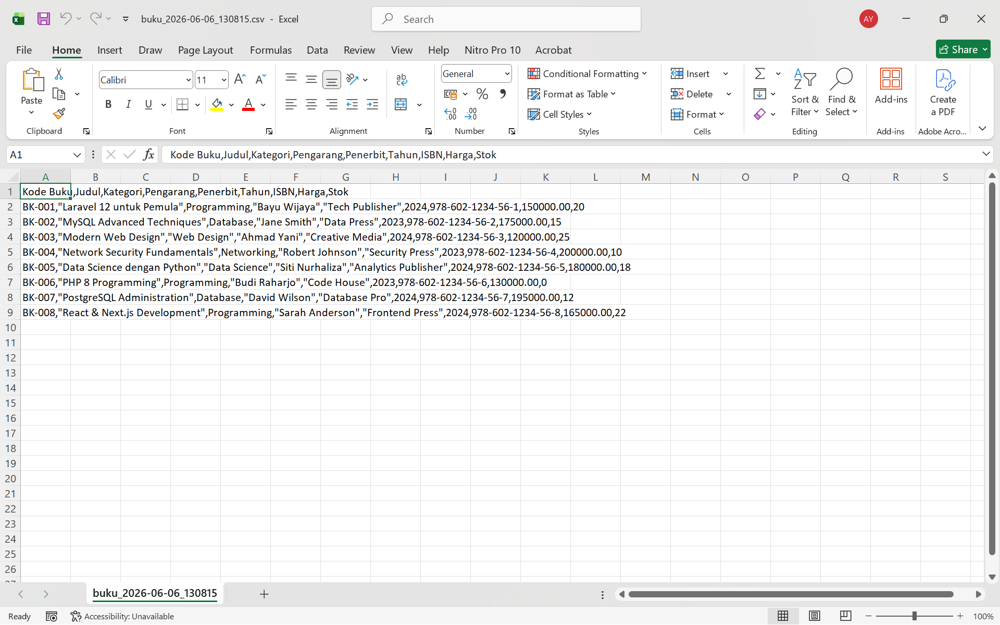

# Tugas Pemrograman Web Pertemuan 12

## Identitas
- Nama: Muhammad Hamdi Yahya
- NIM: 60324035
- Kelas: B
- Mata Kuliah: Pemorgraman Web 2

---

# Tugas yang dibuat

## Tugas 1 - Validation Rules Advanced (30%)
- Membuat Custom Validation Rule `KodeBukuFormat` dengan format: BK-[A-Z]{2,4}-[0-9]{3}
- Contoh valid: BK-PROG-001, BK-DB-002
- Conditional Validation: Jika kategori "Programming", bahasa harus "Inggris"
- Conditional Validation: Jika tahun terbit < 2000, stok maksimal 5
- Custom error messages dalam Bahasa Indonesia

## Tugas 2 - Bulk Delete Operations (35%)
- Implementasi fitur delete multiple buku sekaligus
- Checkbox per buku dan fitur "Pilih Semua" (Select All)
- Tombol "Hapus Terpilih" dengan counter jumlah buku yang dipilih
- Konfirmasi SweetAlert sebelum menghapus
- Method `bulkDelete()` di `BukuController`
- Route: `POST /buku/bulk-delete`

## Tugas 3 - Export Buku ke CSV (35%)
- Fitur export seluruh data buku ke file CSV
- Tombol "Export CSV" pada halaman daftar buku
- File CSV berisi: Kode Buku, Judul, Kategori, Pengarang, Penerbit, Tahun, ISBN, Harga, Stok
- Nama file otomatis dengan timestamp: `buku_YYYY-MM-DD_HHmmss.csv`
- Method `export()` di `BukuController`
- Route: `GET /buku/export`

---

# Screenshot Hasil

> Semua screenshot disimpan di folder `image/`

## 1. Validasi Format Kode Buku
Menampilkan error validasi ketika format kode buku tidak sesuai format BK-XXX-000.

---

## 2. Validasi Conditional - Kategori Programming
Menampilkan error validasi bahasa harus Inggris untuk kategori Programming.

---

## 3. Validasi Conditional - Tahun Terbit < 2000
Menampilkan error validasi stok maksimal 5 untuk buku terbitan sebelum tahun 2000.

---

## 4. Fitur Bulk Delete - Checkbox Select All
Menampilkan fitur checkbox untuk memilih semua buku sekaligus.

---

## 5. Konfirmasi Bulk Delete
Menampilkan popup konfirmasi SweetAlert sebelum menghapus buku terpilih.

---

## 6. Hasil Bulk Delete
Menampilkan pesan sukses setelah buku berhasil dihapus secara massal.

---

## 7. Tombol Export CSV
Menampilkan tombol Export CSV pada halaman daftar buku.

---

## 8. Hasil File CSV
Menampilkan isi file CSV yang berhasil diexport.

